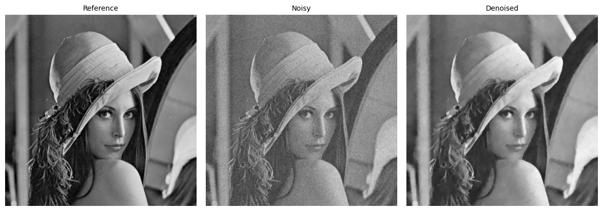
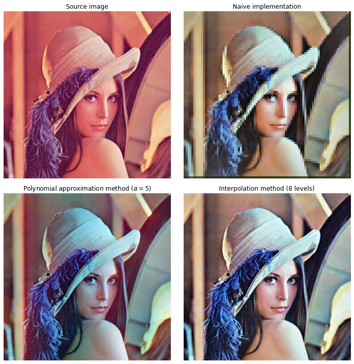
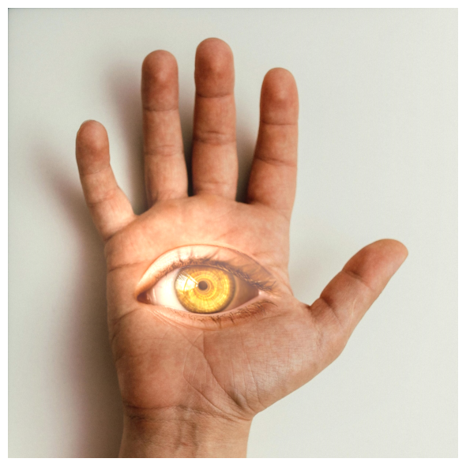
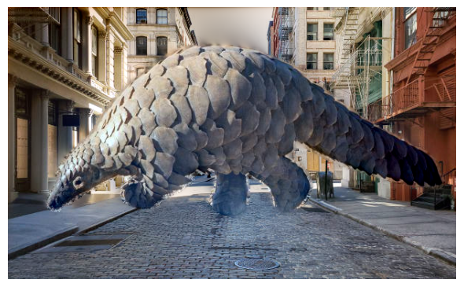

# Image processing

This repo contains implementations of classic image processing algorithms. Most of the methods are based on principles still in use today. However, some methods are largely outdated but fun to implement. What's more, the visual result is often quite appealing. 

## Total Variation Denoising

    

## Automatic Color Enhancement

    

## Pyramid Blending

    

